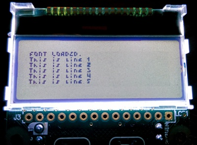

Font library for MicroPython
============================

The [LCD32MKv1.0](https://micropython.org/store/#/products/LCD32MKv1_0) features
a 4-line graphical LCD with 128x32 pixels. I wanted to fit a bit more on the
small screen so I looked for a smaller font.

I found [Four Pixel Caps](http://www.dafont.com/four-pixel-caps.font) and
converted it into an array of bits. And since you can't just set a font with the
LCD module, I had to write my own writing routines to have virtual lines,
line breaks, etc..

This library is `FontLCD`. Just use it like you would `pyb.LCD`.

And this is what it looks like:




Example
-------

```python
import fontlcd

lcd = fontlcd.FontLCD('X')
lcd.light(True)
lcd.loadFont('fourpx')
lcd.write('Hello world!\n')
```

Also see the included `main.py`.

(The mpr121.py is a copy from the example file mentioned in the
[LCD/touch skin documentation](http://docs.micropython.org/en/latest/pyboard/tutorial/lcd_skin.html#using-the-touch-sensor).)
